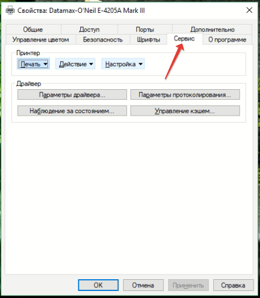
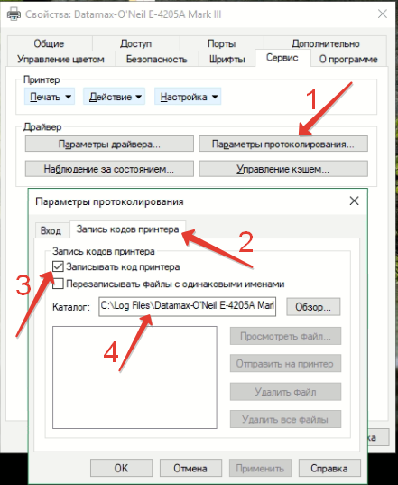
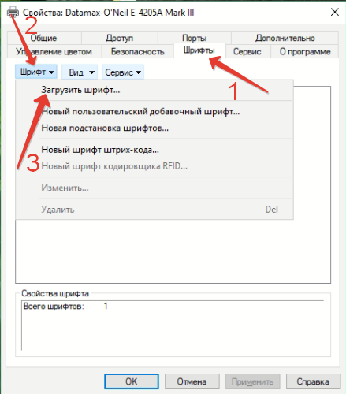
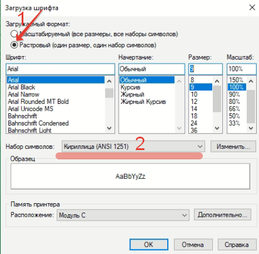
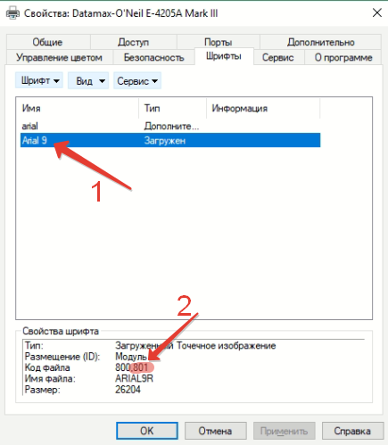
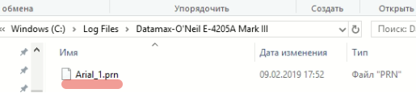

# Создание растрового шрифта средствами драйвера принтера

1. Открыть настройки принтера на закладке сервис: 

2. Включить протоколирование: 

Запомните путь, в который драйвер складывает логи протокола (п. 4).

3. Перейдите на закладку шрифты (п.1), откройте выпадающий список "Шрифт" (п.2) и выберите пункт "загрузить шрифт" (п.3) 

4. Загрузите нужный шрифт: 
* формат "растровый"
* Шрифт/начертание/размер - на ваш вкус
* убедитесь что набор символов Ansi 1251 

5. Выберите загруженный шрифт и в свойствах шрифта (п.2) запомните **второй** номер шрифта 

6. В каталоге, который мы запомнили при включении протоколирования, появился файл с командами для загрузки шрифта. Этот файл "как есть" копируем в каталог с программой,переименовываем в *default.font* и в настройках программы (<название программы>.ini) добавляем/изменяем параметр font_id=<номер шрифта, который мы запомнили на предыдущем шаге> 

7. Не забудьте выключить протоколирование

